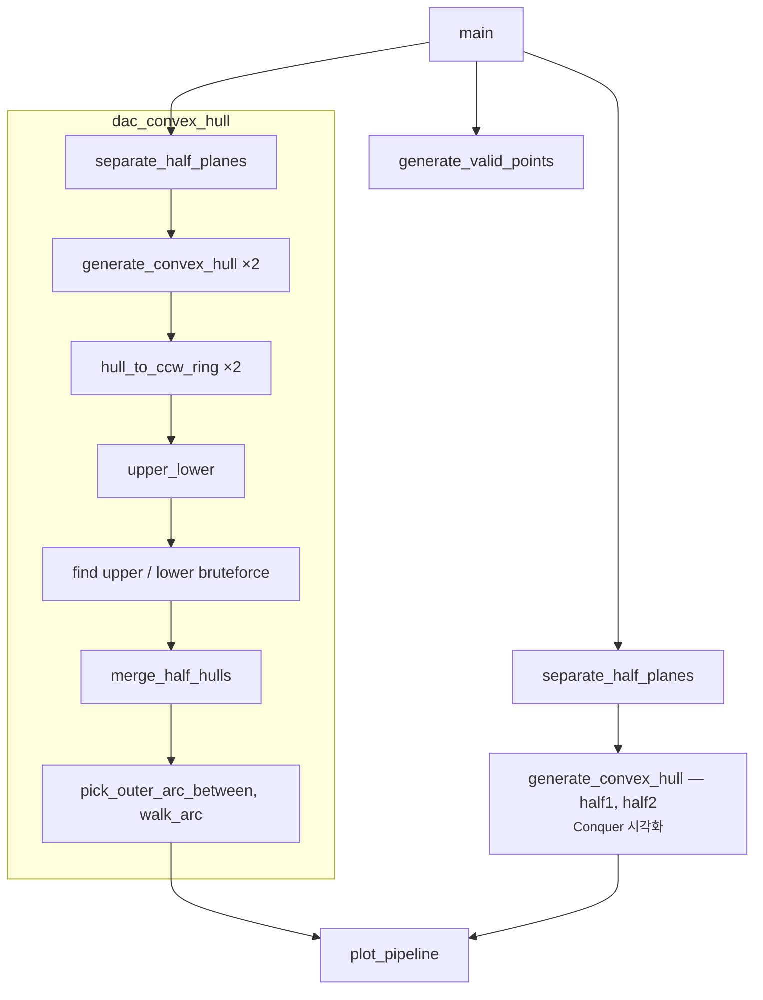

# DAC Convex Hull — 코드와 설명 (mixed)

`dac_convex_hull_standalone.py`를 **함수 단위**로 읽기 쉽게 풀었습니다. 아래 코드 블록은 파일과 동일한 내용입니다.

---

## 0. 목표와 제약

- **Divide & Conquer** 스타일로 볼록 껍질을 구성합니다.
- **알고리즘 라이브러리 없음** (scipy/shapely 등 미사용). `matplotlib`은 그림만.
- **Merge API**는 노트북과 맞춤: `upper_lower(hull1, hull2)` → `merge_half_hulls(...)`.  
접선은 노트북의 `x_separator` 휴리스틱 대신 **orient 기반 브루트포스**로 “진짜” 상·하 접선을 고릅니다.

### Project Overview



---

## 1. 유효한 점 생성 (중복·공선 제거)

**역할:** 정수 격자 `(1…100)²`에서 점을 뽑되, **같은 x 또는 같은 y를 가진 두 점이 없게** 하고, **임의의 세 점이 한 직선 위에 놓이지 않게** 합니다.

`is_collinear`는 이미 있는 두 점 `p1, p2`와 **다른 점 `p3`**가 공선인지 검사합니다 (기울기 비교를 정수식으로).

```python
def is_collinear(p1: Point, p2: Point, points: Set[Point]) -> bool:
    x1, y1 = p1
    x2, y2 = p2
    for p3 in points:
        if p3 == p1 or p3 == p2:
            continue
        x3, y3 = p3
        if (y2 - y1) * (x3 - x2) == (y3 - y2) * (x2 - x1):
            return True
    return False
```

`generate_valid_points`는 집합에 점을 하나씩 넣으며, **x/y 축 중복** 또는 **공선**이면 버리고 다시 뽑습니다.

```python
def generate_valid_points(num_points: int, seed: Optional[int] = 42) -> List[Point]:
    if seed is not None:
        random.seed(seed)
    points: Set[Point] = set()
    while len(points) < num_points:
        x = random.randint(1, 100)
        y = random.randint(1, 100)
        point = (x, y)
        valid = True
        for p in points:
            if p[0] == x or p[1] == y or is_collinear(p, point, points):
                valid = False
                break
        if valid:
            points.add(point)
    return list(points)
```

---

## 2. Divide — x 정렬 후 반으로 자르기

**역할:** 기하학적 “반평면”이 아니라, **x 좌표로 정렬한 뒤 앞/뒤 절반**으로 나눕니다. 왼쪽 묶음이 왼쪽 half, 오른쪽 묶음이 오른쪽 half입니다.

```python
def separate_half_planes(points: List[Point]) -> Tuple[List[Point], List[Point]]:
    points_sorted = sorted(points, key=lambda p: p[0])
    mid = len(points_sorted) // 2
    return points_sorted[:mid], points_sorted[mid:]
```

---

## 3. Conquer — Gift Wrapping (Jarvis march)

**역할:** 각 half에 대해 **노트북과 동일한** Gift wrapping으로 볼록 껍질 꼭짓점을 순서대로 모읍니다.  
내부 `get_orientation`은 벡터 `(origin→p1)`와 `(origin→p2)`의 외적 부호로 “p2가 p1보다 더 왼쪽으로 도는지”를 봅니다.

**주의:** 내부 루프에서 다음 후보를 고를 때 `**is`로 같은 객체인지** 봅니다 (튜플 값 동등 `==`가 아님). 노트북과 맞춘 부분입니다.

```python
def generate_convex_hull(points: List[Point]) -> List[Point]:
    def get_orientation(origin: Point, p1: Point, p2: Point) -> int:
        return ((p2[0] - origin[0]) * (p1[1] - origin[1])) - (
            (p1[0] - origin[0]) * (p2[1] - origin[1])
        )

    sorted_points = sorted(points, key=lambda p: (p[0], p[1]))
    # ... start = 가장 왼쪽(동률이면 아래) 점 선택 ...
    # while 루프에서 far_point를 갱신하며 hull_points에 추가
    return hull_points
```

(전체 루프는 파일 79–113행 참고.)

---

## 4. Merge 준비 — CCW 링, 외적, 호 걷기

### 4.1 `orient`

직선 `a→b` 기준으로 점 `c`가 **반시계(왼쪽)** 이면 양수입니다. 접선 조건과 호 선택에 씁니다.

```python
def orient(a: Point, b: Point, c: Point) -> int:
    return (b[0] - a[0]) * (c[1] - a[1]) - (b[1] - a[1]) * (c[0] - a[0])
```

### 4.2 `hull_to_ccw_ring`

Gift wrapping 결과에서 **닫힌 점의 중복**을 떼고, **슈레이크 면적 부호**로 한 바퀴가 **반시계(CCW)** 가 되도록 뒤집습니다. 이후 merge는 **CCW 순서의 링**을 가정합니다.

```python
def hull_to_ccw_ring(hull_raw: List[Point]) -> List[Point]:
    if len(hull_raw) < 2:
        return hull_raw[:]
    h = hull_raw[:]
    if h[0] == h[-1]:
        h = h[:-1]
    if len(h) < 3:
        return h
    n = len(h)
    s = 0
    for i in range(n):
        s += h[i][0] * h[(i + 1) % n][1] - h[(i + 1) % n][0] * h[i][1]
    if s < 0:
        h = h[::-1]
    return h
```

### 4.3 `walk_arc`

다각형 꼭짓점 배열에서 `start_i`에서 `end_i`까지, **인덱스를 증가/감소** 방향으로만 걸어갑니다. 두 꼭짓점 사이에는 **두 개의 호**가 있으므로, 나중에 둘 중 하나를 고릅니다.

```python
def walk_arc(
    hull: List[Point], start_i: int, end_i: int, forward: bool
) -> List[Point]:
    n = len(hull)
    out: List[Point] = []
    i = start_i
    for _ in range(n + 2):
        out.append(hull[i])
        if i == end_i:
            break
        if forward:
            i = (i + 1) % n
        else:
            i = (i - 1 + n) % n
    else:
        raise RuntimeError("walk_arc: could not reach end")
    return out
```

---

## 5. 바깥 호 선택 — `pick_outer_arc_between`

**문제:** 같은 두 접점을 잇는 경로는 **시계/반시계 두 갈래**인데, merge에는 **전체 볼록 껍질 `CH(L∪R)`의 바깥 경계**만 필요합니다.

**아이디어:**

- **왼쪽 다각형 L:** 바깥은 대체로 **서쪽** 가장자리 → 후보 호 중 **min x**가 더 작고, 동률이면 **x 합**이 더 작은 쪽.
- **오른쪽 다각형 R:** 바깥은 **동쪽** 가장자리 → **max x**가 더 크고, 동률이면 **x 합**이 더 큰 쪽.

```python
def pick_outer_arc_between(
    hull: List[Point], i_a: int, i_b: int, *, is_left_polygon: bool
) -> List[Point]:
    fwd = walk_arc(hull, i_a, i_b, True)
    bwd = walk_arc(hull, i_a, i_b, False)

    def west_chain_key(arc: List[Point]) -> Tuple[int, int]:
        return (min(p[0] for p in arc), sum(p[0] for p in arc))

    def east_chain_key(arc: List[Point]) -> Tuple[int, int]:
        return (max(p[0] for p in arc), sum(p[0] for p in arc))

    if is_left_polygon:
        return fwd if west_chain_key(fwd) <= west_chain_key(bwd) else bwd
    return fwd if east_chain_key(fwd) >= east_chain_key(bwd) else bwd
```

---

## 6. 상·하 공통 접선 (브루트포스)

**위쪽 접선:** 모든 `(p,q) ∈ L×R`에 대해, `L∪R`의 나머지 점 `r`마다 `orient(p,q,r) ≤ 0`이면 “직선 pq 위에 다른 점이 없음” → 위쪽 지지선 후보. 후보가 여러 개면 키로 하나를 고릅니다.

```python
def find_upper_tangent_bruteforce(L: List[Point], R: List[Point]) -> Tuple[Point, Point]:
    pts = L + R
    candidates: List[Tuple[Point, Point]] = []
    for p in L:
        for q in R:
            if all(
                orient(p, q, r) <= 0
                for r in pts
                if r != p and r != q
            ):
                candidates.append((p, q))
    if not candidates:
        raise RuntimeError("upper tangent not found")
    return max(candidates, key=lambda pq: (min(pq[0][1], pq[1][1]), max(pq[0][1], pq[1][1])))
```

**아래쪽 접선:** 모든 `r`에 `orient(p,q,r) ≥ 0`.

```python
def find_lower_tangent_bruteforce(L: List[Point], R: List[Point]) -> Tuple[Point, Point]:
    pts = L + R
    candidates = []
    for p in L:
        for q in R:
            if all(
                orient(p, q, r) >= 0
                for r in pts
                if r != p and r != q
            ):
                candidates.append((p, q))
    if not candidates:
        raise RuntimeError("lower tangent not found")
    return min(candidates, key=lambda pq: (max(pq[0][1], pq[1][1]), pq[0][0] + pq[1][0]))
```

### `upper_lower` — 노트북과 같은 튜플 순서

- `upper_bound = (hull1 위 접점, hull2 위 접점)`
- `lower_bound = (hull2 아래 접점, hull1 아래 접점)`  
→ `merge_half_hulls`에서 `lower_bound[0]`은 hull2, `[1]`은 hull1로 씁니다.

```python
def upper_lower(hull1: List[Point], hull2: List[Point]) -> Tuple[Tuple[Point, Point], Tuple[Point, Point]]:
    p_up, q_up = find_upper_tangent_bruteforce(hull1, hull2)
    p_lo, q_lo = find_lower_tangent_bruteforce(hull1, hull2)
    upper_bound = (p_up, q_up)
    lower_bound = (q_lo, p_lo)
    return upper_bound, lower_bound
```

---

## 7. `merge_half_hulls` — 두 half를 한 껍질로

**절차 요약**

1. `upper_bound` / `lower_bound`에서 각 hull의 접점 인덱스를 구함.
2. **L:** `p_lo` → `p_up` 사이 **바깥 호** (`is_left_polygon=True`).
3. **R:** `q_up` → `q_lo` 사이 **바깥 호** (`is_left_polygon=False`).
4. 두 체인을 이어 붙이고, **연속 중복** 제거 후 필요하면 **닫기**.

```python
def merge_half_hulls(
    hull1: List[Point],
    hull2: List[Point],
    upper_bound: Tuple[Point, Point],
    lower_bound: Tuple[Point, Point],
) -> List[Point]:
    p_up, q_up = upper_bound
    q_lo, p_lo = lower_bound

    i_up = hull1.index(p_up)
    i_lo = hull1.index(p_lo)
    j_up = hull2.index(q_up)
    j_lo = hull2.index(q_lo)

    left_chain = pick_outer_arc_between(hull1, i_lo, i_up, is_left_polygon=True)
    right_chain = pick_outer_arc_between(hull2, j_up, j_lo, is_left_polygon=False)

    merged = left_chain + right_chain

    cleaned = []
    for p in merged:
        if not cleaned or cleaned[-1] != p:
            cleaned.append(p)

    if cleaned[0] != cleaned[-1]:
        cleaned.append(cleaned[0])

    return cleaned
```

`merge_half_hulls_outer_fallback`은 접선은 맞는데 메인 merge에서 예외가 날 때, **같은 바깥 호 로직**만으로 이어 붙이는 백업입니다.

---

## 8. 전체 DAC 파이프라인 — `dac_convex_hull`

```python
def dac_convex_hull(points: List[Point]) -> List[Point]:
    h1, h2 = separate_half_planes(points)
    raw_a = generate_convex_hull(h1)
    raw_b = generate_convex_hull(h2)
    hull1_ccw = hull_to_ccw_ring(raw_a)
    hull2_ccw = hull_to_ccw_ring(raw_b)

    upper_bound, lower_bound = upper_lower(hull1_ccw, hull2_ccw)
    try:
        merged = merge_half_hulls(hull1_ccw, hull2_ccw, upper_bound, lower_bound)
    except RuntimeError:
        p_up, q_up = upper_bound
        q_lo, p_lo = lower_bound
        merged = merge_half_hulls_outer_fallback(
            hull1_ccw, hull2_ccw, p_up, q_up, p_lo, q_lo
        )
    return merged
```

**한 줄로:** 나누고 → 각각 Gift wrapping → CCW로 정리 → 상·하 접선 → 바깥 호만 이어 merge.

---


