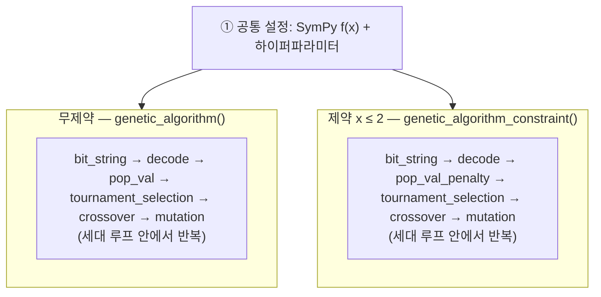
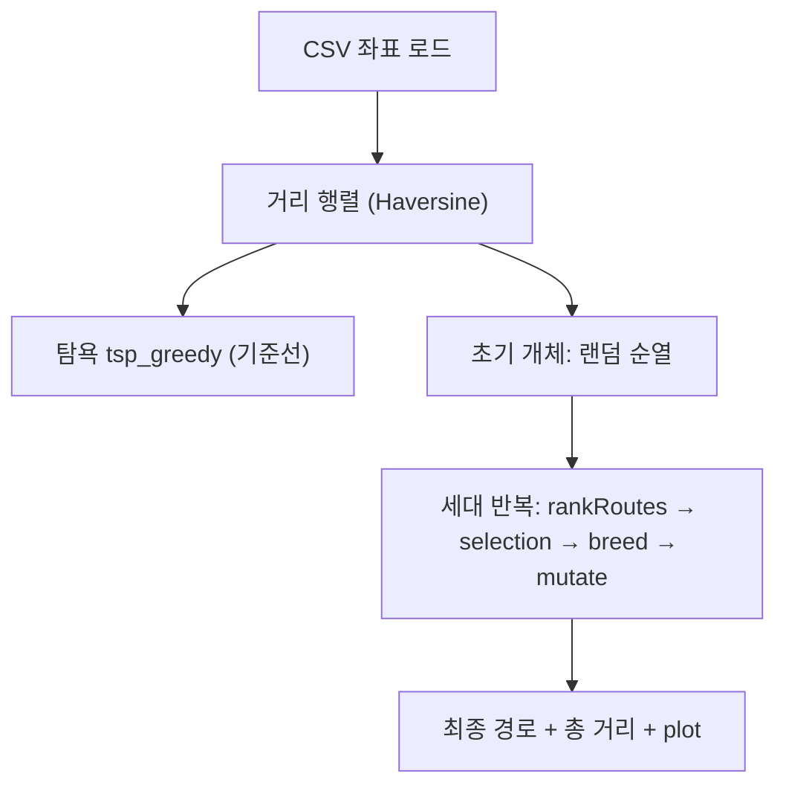

# Genetic algorithm — Task 1

**유전 알고리즘(genetic algorithm)** 구현 코드

---

## 이 폴더에 있는 파일

| File | 내용 |
|------|------|
| `Task1.ipynb` | **Task 1:** 1차원 함수 최적화 GA  |
| `Task 2.ipynb` | **Task 2:** TSP + GA  |

---

## 1. 유전 알고리즘(GA)이란?

**“진화”의 구조를 모방한 최적화** 방법.

- **개체** = 후보 해 (여기서는 0/1로 된 **비트열** 하나가 하나의 `x` 후보).
- **적합도** = 그 해가 목적함수에서 얼마나 좋은지 (이 노트북은 **값이 작을수록 좋음** 쪽으로 맞춤).
- 한 세대마다:
  1. **선택(selection)** — 잘 나온 개체를 부모로 고름 (여기서는 **토너먼트**).
  2. **교차(crossover)** — 부모 비트열을 잘라 붙여 자식 생성.
  3. **돌연변이(mutation)** — 비트를 가끔 뒤집어서 다양성 유지.
- 이걸 여러 세대 반복하면서, 점점 **더 좋은 `x`** 쪽으로 모입니다.

미분이 어렵거나 해가 복잡해도 **“진화시키듯”** 탐색할 수 있는 방법.

---

## 2. 알고리즘 구현

`sklearn` 같은 **완성된 GA 블랙박스**만 부르는 게 아니라,

- 비트 만들기 → 실수로 풀기 → 적합도 계산 → 선택 → 교차·돌연변이 → 세대 갱신  
까지 **함수 단위로 직접 짜서** 돌리는 **과제용 구현**이에요.

그래서 코드에 **`bit_string`, `decode`, `tournament_selection`, `crossover`, `mutation`** 같은 조각이 나뉘어 있고, 마지막에 **`genetic_algorithm()`** 이 조각들을 **한 루프**로.

추가로 **제약 \(x \le 2\)** 버전은, 목적값에 **패널티**를 더하는 **`pop_val_penalty`** + **`genetic_algorithm_constraint()`** 로 같은 뼈대를 재사용.

---

## 3. 목적함수 (SymPy)

최적화할 함수:

\[
f(x) = 2x^4 - 10x^3 + 8x^2 + 5x
\]

 `x = symbols('x')`, `fx = 2*x**4 - ...` 로 정의 후, 점에서 값을 볼 때 `subs` 등을 사용.

---

## 4. 표현 (인코딩)

| 항목 | 값 | 한 줄 설명 |
|------|-----|------------|
| 변수 개수 | `var_num = 1` | 한 번에 최적화하는 실수는 `x` 하나 |
| 비트 길이 | `bits = 16` | 염색체는 16비트 문자열 |
| 탐색 구간 | `bounds = (-5, 5)` | `decode`가 비트열을 이 구간 안의 실수로 바꿈 |

---

## 5. 하이퍼파라미터 (사용자 설정하며 수정)

| 이름 | 값 | 직관 |
|------|-----|------|
| `max_iter` | 200 | 최대 반복 세대 |
| `pop_num` | 20 | 첫 세대 개체 수 |
| `next_generation` | 20 | 자식으로 만들 개체 수 |
| `tournament_size` | 16 | 토너먼트에 몇 명을 넣을지 |
| `cross_rate` | 0.8 | 교차가 일어날 확률 |
| `muta_rate` | 0.1 | 돌연변이 확률 |
| `penalty_factor` | 100000 | 제약 위반 시 벌점 크기 |
| `epsilon` | 0.1 | 경계 \(x=2\) 근처에서 수치적으로 튀는 걸 완화 |

---

## 6. 코드 구조

전체는 **도구 함수들** + **메인 루프 두 종류**로 나뉩니다.




두 갈래의 **차이**는 평가 단계만 `pop_val` vs `pop_val_penalty` 이고, 나머지 연산자(선택·교차·돌연변이) 구조는 같습니다.


### 함수 설명

| 함수 | 한 줄 |
|------|------|
| `bit_string` | 첫 세대 비트열 만들기 |
| `decode` | 비트 → 실수 `x` |
| `pop_val` | 무제약일 때 목적값 채우기 |
| `tournament_selection` | 부모 선택 |
| `crossover` | 자식 비트열 (교차) |
| `mutation` | 비트 뒤집기 (돌연변이) |
| `genetic_algorithm` | 위 부품들로 **무제약** 루프 전체 |
| `pop_val_penalty` | **\(x \le 2\)** 깨면 벌점 추가 |
| `genetic_algorithm_constraint` | 패널티를 쓴 **제약** 루프 |
| `f(xx)` | 후반에 나오는 **숫자만** 넣어 평가하는 도우미 |

---

## 7. 실행 흐름 (무제약 vs 제약)

### 무제약

```text
fx 정의
  → bit_string
  → 반복:
        decode → pop_val → (적합도 비교)
        tournament_selection → crossover → mutation
        세대 합치기 / 갱신 (이전 최적과 같으면 종료 등)
  → matplotlib: f(x) 모양, 수렴 과정 그래프
```

### 제약 \(x \le 2\)

```text
같은 뼈대
  → decode → pop_val_penalty (2 넘어가면 제곱 패널티)
  → genetic_algorithm_constraint()
  → 결과 표(pop_df 등)로 확인
```

---
## 8. 결과 해석

- \(f(x)\) 그래프  
- 세대가 바뀔수록 **좋아지는 해 / 분포** 플롯
- 제약 파트: **\(x \le 2\)** 해석, 가끔 **\(x > 2\)** 이 나오는 경우와 **`epsilon`** 역할

---
---

# Genetic algorithm — Task 2

> **Genetic** 알고리즘을 활용한 과제

| 항목  | 내용                                                                         |
| --- | -------------------------------------------------------------------------- |
| 노트북 | `Task 2.ipynb`                                                       |
| 문제  | 도시(배송 지점)들을 **한 번씩** 돌아 **총 이동 거리**를 줄이는 경로 찾기                             |
| 데이터 | 미국 도시 배송 좌표 CSV (`Atlanta` / `Cincinnati` / `Philadelphia` 등, 노트북에서 하나 선택) |
| 비교  | **탐욕(nearest-neighbor) 경로** + **GA 경로**                                    |


---

## 1. TSP(Traveling Salesman Problem)이란?

- 지점이 n개 있을 때, **각 지점을 정확히 한 번씩** 방문하고 돌아오는 **닫힌 경로(순환)** 중에서  
**총 거리(또는 비용)가 최소**가 되는 순서를 찾는 조합 최적화 문제예요.
- 지점 수가 조금만 많아져도 경우의 수가 폭발해서, **정확히 다 찾기**는 어렵고  
**휴리스틱·메타휴리스틱(탐욕, GA, …)** 으로 좋은 해를 찾는 경우가 많아요.

---

## 2. 이 노트북은 어떻게 푸나요? (손으로 구현한 GA)

- 좌표 CSV를 읽고, 지점 간 **거리 행렬**을 만든 뒤  
**경로 = 도시 순열(permutation)** 로 인코딩합니다. (Task 1의 비트열 인코딩과 다름.)
- **개체** = “어느 순서로 배송할지” 한 줄짜리 경로.
- **적합도**는 총 거리의 **역수**에 가깝게 설계되어, **거리가 짧을수록 적합도가 크도록** (`Fitness.routeFitness` — 노트북에서 `1/거리` 형태로 랭킹).
- 선택은 **엘리트 + 룰렛(roulette)** 스타일, 교차는 한 구간을 부모1에서 가져오고 나머지를 부모2 순서로 채우는 **순열용 교차(`breed`)**, 변이는 **스왑 돌연변이(`mutate`)**.
- 앞부분에는 같은 데이터로 **거리 행렬 + 탐욕 기준선(`tsp_greedy`)** 도 있어서, GA 결과와 비교·시각화하기 좋게 되어 있어요.

---

## 3. 데이터와 거리

- CSV 컬럼 예: 위도·경도, 지점 **인덱스** (`Longitude (deg)`, `Latitude (deg)`, `Index` 등 — 실제 헤더는 파일 기준).
- 노트북 앞에서는 **이중 루프 + Haversine(구면 거리)** 로 n \times n **거리 행렬**을 직접 채웁니다.
- 후반 `City` 클래스에서는 `**haversine`** 라이브러리로 두 점 사이 거리(미터)를 계산하기도 합니다.
- **로컬 실행 시:** 원래 Colab에서 `pd.read_csv("Atlanta.csv")` 등 **같은 폴더에 CSV**를 두거나, 경로를 수정해야 합니다.


### 3.1 Haversine**
- 배송 지점은 **위도·경도**로 주어지는데, 이 둘은 **평면 위의 x, y 좌표가 아니라** 지구(구면) 위의 각도.
- 위·경도를 그대로 **평면에서 유클리드 거리**처럼 빼서 쓰면, 실제 지표상 거리와 **비율·방향이 어긋날 수** 있음 (특히 북위가 커질수록 위도 1°와 경도 1°의 실제 길이가 달라지는 문제).
- 그래서 **구 위의 두 점 사이 최단 거리**인 **대원 거리(great-circle distance)** 를 쓰는 게 자연스럽고, 그걸 수치적으로 잘 다루는 공식인 **Haversine** 공식 활용.

### 3.2 How? 

- **수학적 아이디어:** 반지름 \(R\)인 구에서 두 점의 위도 \(\phi_1,\phi_2\), 경도 \(\lambda_1,\lambda_2\)를 라디안으로 두고,  
  중심각 \(d\)에 대해  
  \(\mathrm{hav}(d)=\mathrm{hav}(\Delta\phi)+\cos\phi_1\cos\phi_2\,\mathrm{hav}(\Delta\lambda)\)  
  (\(\mathrm{hav}(\theta)=\sin^2(\theta/2)\)) 를 풀어 **호의 길이 \(= R\cdot d\)** 로 거리 계산. (구현은 보통 `atan2`로)
- **코드에서는** 직접 식을 쓰지 않고, Python 패키지 **`haversine`** 의 `haversine(loc1, loc2, unit=...)` 을 호출해 같은 원리로 거리를 구함.
  - 좌표는 **튜플 `(위도, 경도)`** 순서로 넘김 (`Latitude (deg)`, `Longitude (deg)` 행에서 읽음).
  - 앞부분 거리 행렬: 모든 쌍 \((i,j)\)에 대해 `haversine(coord_i, coord_j, unit='m')` 으로 **미터** 단위 거리를 구하고, **대칭**으로 `d_a_matrix[i][j] = d_a_matrix[j][i]` 에 input.
  - `City` 쪽에서는 `haversine(a, b, unit=Unit.METERS)` 로 동일하게 **미터** 기준으로 맞춤.


---

## 4. 하이퍼파라미터

`geneticAlgorithm(...)` 호출 예:


| 이름             | 예시 값 | 직관                     |
| -------------- | ---- | ---------------------- |
| `popSize`      | 200  | 개체(경로) 개수              |
| `eliteSize`    | 20   | 다음 세대로 그대로 가져올 상위 경로 수 |
| `mutationRate` | 0.01 | 스왑 돌연변이 확률             |
| `generations`  | 500  | 세대 반복 횟수               |


(출력에 나오는 “Initial distance / Final distance”는 노트북이 적합도를 거리로 다시 환산해 출력하는 방식.)

---

## 5. 함수·클래스 


| 이름                                     | 역할                                |
| -------------------------------------- | --------------------------------- |
| `tsp_greedy(distances)`                | 거리 행렬 기준 **탐욕** 기준선 경로            |
| `compute_total_distance(matrix, path)` | 한 순열의 **총 거리**                    |
| `City`                                 | 좌표 보관, `haversine`으로 다른 도시까지 거리   |
| `Fitness`                              | 경로에 대해 **routeFitness** (짧을수록 좋게) |
| `createRoute` / `initialPopulation`    | 무작위 순열로 초기 개체 집단                  |
| `rankRoutes`                           | 경로별 적합도 순위                        |
| `selection` / `matingPool`             | 부모 선택                             |
| `breed` / `breedPopulation`            | 순열 **교차**                         |
| `mutate` / `mutatePopulation`          | **스왑** 변이                         |
| `nextGeneration`                       | 한 세대 진행                           |
| `geneticAlgorithm`                     | 전체 루프 + 시작/끝 거리 출력                |
| `geneticAlgorithmPlot`                 | 세대별 진행을 모아 **그래프**용               |


---

## 6. 구조 다이어그램



---
## 7. 실행 Flow

CSV 읽기
  → 거리 행렬 계산
  → (선택) tsp_greedy 로 기준 거리/경로
  → City 리스트 구성
  → initialPopulation → [세대 반복] rankRoutes → selection → breed → mutate
  → 최종 bestRoute + 거리 출력 + 경로 시각화

---

## 8. 결과

- 선택한 도시의 **배송 지점 산점도** + 인덱스 라벨  
- **탐욕 경로** / **GA 경로** 의 총 거리 및 **지도상 경로 플롯**  
- (옵션) `geneticAlgorithmPlot` 로 **세대에 따른 거리 감소** 추이

---

