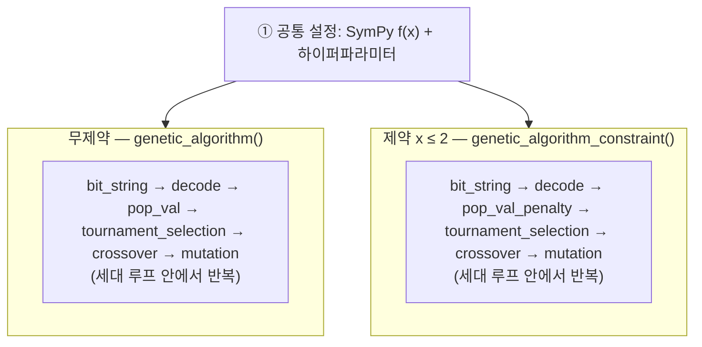

# Genetic algorithm — Task 1

**유전 알고리즘(genetic algorithm)** 구현 코드

---

## 이 폴더에 있는 파일

| File | 내용 |
|------|------|
| `Task1.ipynb` | **Task 1:** 1차원 함수 최적화 GA  |
| `Task 2.ipynb` | **Task 2:** TSP + GA  |

---

## 1. 유전 알고리즘(GA)이란?

**“진화”의 구조를 모방한 최적화** 방법.

- **개체** = 후보 해 (여기서는 0/1로 된 **비트열** 하나가 하나의 `x` 후보).
- **적합도** = 그 해가 목적함수에서 얼마나 좋은지 (이 노트북은 **값이 작을수록 좋음** 쪽으로 맞춤).
- 한 세대마다:
  1. **선택(selection)** — 잘 나온 개체를 부모로 고름 (여기서는 **토너먼트**).
  2. **교차(crossover)** — 부모 비트열을 잘라 붙여 자식 생성.
  3. **돌연변이(mutation)** — 비트를 가끔 뒤집어서 다양성 유지.
- 이걸 여러 세대 반복하면서, 점점 **더 좋은 `x`** 쪽으로 모입니다.

미분이 어렵거나 해가 복잡해도 **“진화시키듯”** 탐색할 수 있는 방법.

---

## 2. 알고리즘 구현

`sklearn` 같은 **완성된 GA 블랙박스**만 부르는 게 아니라,

- 비트 만들기 → 실수로 풀기 → 적합도 계산 → 선택 → 교차·돌연변이 → 세대 갱신  
까지 **함수 단위로 직접 짜서** 돌리는 **과제용 구현**이에요.

그래서 코드에 **`bit_string`, `decode`, `tournament_selection`, `crossover`, `mutation`** 같은 조각이 나뉘어 있고, 마지막에 **`genetic_algorithm()`** 이 조각들을 **한 루프**로.

추가로 **제약 \(x \le 2\)** 버전은, 목적값에 **패널티**를 더하는 **`pop_val_penalty`** + **`genetic_algorithm_constraint()`** 로 같은 뼈대를 재사용.

---

## 3. 목적함수 (SymPy)

최적화할 함수:

\[
f(x) = 2x^4 - 10x^3 + 8x^2 + 5x
\]

 `x = symbols('x')`, `fx = 2*x**4 - ...` 로 정의 후, 점에서 값을 볼 때 `subs` 등을 사용.

---

## 4. 표현 (인코딩)

| 항목 | 값 | 한 줄 설명 |
|------|-----|------------|
| 변수 개수 | `var_num = 1` | 한 번에 최적화하는 실수는 `x` 하나 |
| 비트 길이 | `bits = 16` | 염색체는 16비트 문자열 |
| 탐색 구간 | `bounds = (-5, 5)` | `decode`가 비트열을 이 구간 안의 실수로 바꿈 |

---

## 5. 하이퍼파라미터 (사용자 설정하며 수정)

| 이름 | 값 | 직관 |
|------|-----|------|
| `max_iter` | 200 | 최대 반복 세대 |
| `pop_num` | 20 | 첫 세대 개체 수 |
| `next_generation` | 20 | 자식으로 만들 개체 수 |
| `tournament_size` | 16 | 토너먼트에 몇 명을 넣을지 |
| `cross_rate` | 0.8 | 교차가 일어날 확률 |
| `muta_rate` | 0.1 | 돌연변이 확률 |
| `penalty_factor` | 100000 | 제약 위반 시 벌점 크기 |
| `epsilon` | 0.1 | 경계 \(x=2\) 근처에서 수치적으로 튀는 걸 완화 |

---

## 6. 코드 구조

전체는 **도구 함수들** + **메인 루프 두 종류**로 나뉩니다.




두 갈래의 **차이**는 평가 단계만 `pop_val` vs `pop_val_penalty` 이고, 나머지 연산자(선택·교차·돌연변이) 구조는 같습니다.


### 함수 설명

| 함수 | 한 줄 |
|------|------|
| `bit_string` | 첫 세대 비트열 만들기 |
| `decode` | 비트 → 실수 `x` |
| `pop_val` | 무제약일 때 목적값 채우기 |
| `tournament_selection` | 부모 선택 |
| `crossover` | 자식 비트열 (교차) |
| `mutation` | 비트 뒤집기 (돌연변이) |
| `genetic_algorithm` | 위 부품들로 **무제약** 루프 전체 |
| `pop_val_penalty` | **\(x \le 2\)** 깨면 벌점 추가 |
| `genetic_algorithm_constraint` | 패널티를 쓴 **제약** 루프 |
| `f(xx)` | 후반에 나오는 **숫자만** 넣어 평가하는 도우미 |

---

## 7. 실행 흐름 (무제약 vs 제약)

### 무제약

```text
fx 정의
  → bit_string
  → 반복:
        decode → pop_val → (적합도 비교)
        tournament_selection → crossover → mutation
        세대 합치기 / 갱신 (이전 최적과 같으면 종료 등)
  → matplotlib: f(x) 모양, 수렴 과정 그래프
```

### 제약 \(x \le 2\)

```text
같은 뼈대
  → decode → pop_val_penalty (2 넘어가면 제곱 패널티)
  → genetic_algorithm_constraint()
  → 결과 표(pop_df 등)로 확인
```

---
## 8. 결과 해석

- \(f(x)\) 그래프  
- 세대가 바뀔수록 **좋아지는 해 / 분포** 플롯
- 제약 파트: **\(x \le 2\)** 해석, 가끔 **\(x > 2\)** 이 나오는 경우와 **`epsilon`** 역할

---
