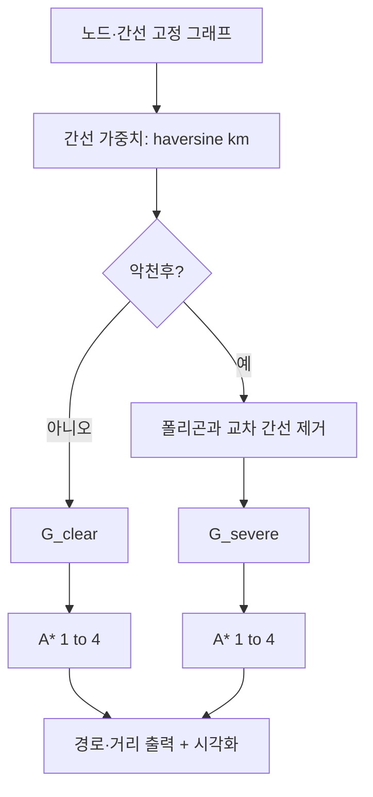

# Flight path optimization — 코드·설명·결과 (mixed)

과제: **제주(노드 1) → 양양(노드 4)** 최단 경로, **맑음 / 악천후** 두 시나리오

---

## 간선 가중치 추정:

**답:** 각 간선은 두 공항(노드) 좌표 **(경도, 위도)** 에 대해 **대원 거리(haversine 공식)** 로 **실제 지구상의 최단 거리(km)** 를 구해 **가중치**로 썼다. 항공기가 직선 구간을 그대로 비행한다고 가정하면, **연료·시간과 단조로운 관계**가 있어 과제에서 말하는 “실제 시나리오에 가깝게” 반영하기에 적절하다.

코어 계산:

```python
def haversine_km(a: Point, b: Point) -> float:
    lon1, lat1 = map(math.radians, a)
    lon2, lat2 = map(math.radians, b)
    dlon = lon2 - lon1
    dlat = lat2 - lat1
    h = math.sin(dlat / 2) ** 2 + math.cos(lat1) * math.cos(lat2) * math.sin(dlon / 2) ** 2
    c = 2 * math.asin(min(1.0, math.sqrt(h)))
    return R_EARTH_KM * c  # R_EARTH_KM = 6371.0
```

---

## 그래프 표현:

**답:** 과제에서 허용한 **고정 토폴로지**만 사용했다 (**3–4 간선 없음**).

- **노드:** 정수 ID `1 … 6`, 좌표는 `NODES[id] = (lon, lat)`.
- **간선:** 무방향 그래프로 `**ADJ` 인접 리스트**에 저장하고, 구현 시 `(u,v)` 한 번만 처리해 **양방향 가중치**를 넣었다.
- **도시명:** 시각화용 `CITY_NAME` (Jeju, Incheon, Daejeon, Yangyang, Busan, Ulsan) — 좌표에 맞춘 **표시용** 이름이다.

```python
NODES: Dict[int, Point] = {
    1: (126.5, 33.5),
    2: (126.5, 37.45),
    3: (127.5, 36.7),
    4: (128.7, 38.1),
    5: (128.9, 35.2),
    6: (129.4, 36.0),
}

ADJ: Dict[int, List[int]] = {
    1: [2, 3, 5],
    2: [1, 3, 4],
    3: [1, 2, 5, 6],
    4: [2, 6],
    5: [1, 3, 6],
    6: [3, 4, 5],
}
```

**이유:** 경로 탐색·시각화·날씨로 간선 제거 시 모두 **인접 리스트**가 단순하고, 노드 수가 작아 **인접 행렬** 대비 이점이 크지 않다.

---

## A* vs 다익스트라 알고리즘:

**선택:** 본 구현의 **주 알고리즘은 A*** 이고, 검증용으로 **다익스트라**를 같이 돌려 **같은 최적값·같은 경로**인지 확인했다.

**근거:**

- 모든 간선 가중치는 **거리(km) ≥ 0** 이므로, **다익스트라**는 확실히 **전역 최단 경로(해당 그래프에서)** 를 준다.
- **A** 는 휴리스틱 `h(u) = haversine(u, goal)` 을 쓴다. 임베딩된 좌표에서 **어떤 경로의 길이도 직선(대원) 거리보다 짧을 수 없으므로** `h`는 **허용(admissible)** 이다 → **최적 경로를 보장**하면서 탐색 우선순위를 줄일 수 있다.

과제 발표에서는 “**둘 다 가능**, 여기서는 **A*** 로 구현하고 **다익스트라로 교차 검증**했다”고 말하면 된다.

---

## 악천후 구간 구현:

과제에서 준 **직사각형 폴리곤**(대류권 회피 구역)과 **비행 구간(선분)** 이 **닫힌 다각형(경계 포함)** 과 교차하면 그 간선은 **사용 불가**로 두었다(`build_weighted_graph(block_weather=True)` 에서 해당 간선 미포함).

```python
WEATHER_POLYGON: List[Point] = [
    (128.7, 36.6), (128.7, 37.6), (129.3, 37.6), (129.3, 36.6),
]
```

교차 판정은 선분–선분 교차(사각형 네 변) + **끝점이 구역 안에 있는지** 검사로 처리한다.

---

## 구현한 의사코드 단계 (요약)

```text
1. 노드 좌표와 고정 간선으로 무방향 그래프 G를 만든다.
2. 각 간선 가중치 = 두 노드 간 haversine 거리(km).
3. 악천후:
   - 폴리곤 P와 교차하는 간선을 G에서 제거한 G_bad를 만든다.
4. 맑음: G에서 시작 1, 목표 4로 A* 실행 (휴리스틱 = 현재 노드→목표 haversine).
5. 악천후: G_bad에 대해 동일.
6. (검증) 다익스트라로 동일 그래프에서 비용·경로 일치 확인.
7. matplotlib으로 노드·간선·폴리곤·두 최단 경로(맑음/악천후 각각)를 그린다.
```

**A 루프(핵심):**

```text
OPEN에 시작 노드 삽입; g(start)=0
OPEN이 빌 때까지:
  (f, g, u) 꺼내기 — 오래된 항목(stale)이면 스킵
  u == goal 이면 경로 역추적 후 종료
  이웃 v에 대해:
    tentative = g(u) + w(u,v)
    g(v) 갱신되면 OPEN에 (g(v)+h(v), g(v), v) 푸시
경로 없으면 실패
```

## 다이어그램




---

## 결과 요약

그래프에서 **노드 3과 4 사이 간선은 없음** (과제 수정 반영). 노드 라벨은 그림에 **도시명**으로 표시 (좌표에 맞춘 표기).


| 시나리오         | 최단 거리 (km)   | 노드 경로 (도시)                                          |
| ------------ | ------------ | --------------------------------------------------- |
| 맑음 (clear)   | **약 631.70** | **1 → 5 → 6 → 4** (Jeju → Busan → Ulsan → Yangyang) |
| 악천후 (severe) | **약 645.64** | **1 → 2 → 4** (Jeju → Incheon → Yangyang)           |


악천후에서 **폴리곤과 겹쳐 제거되는 간선**은 `(4, 6)` (Ulsan–Yangyang) 뿐이다. 맑음에서는 이 간선을 쓰는 경로가 **가장 짧았는데**, 악천후에서는 해당 간선이 막혀 **서해 쪽 경로** `1–2–4`**로 우회**하면서 거리·경로가 달라진다.

생성 이미지: `**flight_path_result.png`** (스크립트와 같은 디렉터리).

```bash
py -3 flight_path_optimization.py
```

